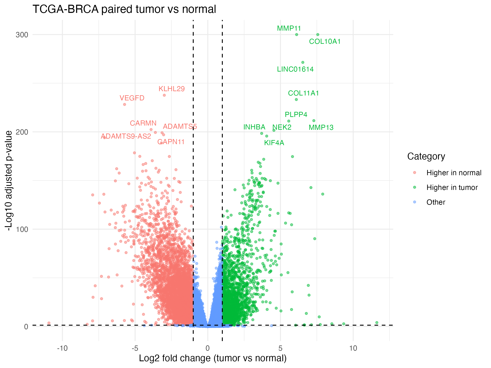
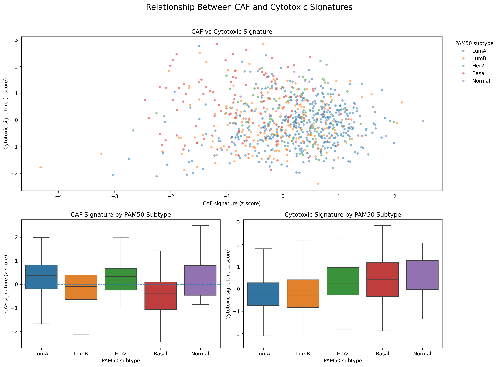

# TCGA-BRCA Bulk RNA-seq Analysis

End-to-end analysis of The Cancer Genome Atlas (TCGA) Breast Invasive Carcinoma (BRCA) RNA-seq data using Python and R. This project demonstrates a reproducible bulk RNA-seq workflow beginning with raw GDC STAR Count files and ending with differential expression and tumor microenvironment analyses.

---

## Project Overview

Breast tumors are composed of malignant cells together with diverse stromal and immune cell populations that influence disease progression and therapeutic response. Cancer-associated fibroblasts (CAFs) can remodel the tumor microenvironment, suppress anti-tumor immunity, and contribute to treatment resistance.

The objective of this project was to build a complete RNA-seq analysis workflow while investigating the relationship between:

- Cancer-associated fibroblast (CAF) transcriptional programs
- Cytotoxic immune activity
- PAM50 molecular breast cancer subtypes

This repository emphasizes reproducible analysis practices and is intended as a portfolio project demonstrating modern bulk RNA-seq analysis using publicly available TCGA data.

---

## Biological Questions

1. Which genes are differentially expressed between matched primary breast tumors and adjacent normal tissue?

2. How variable are CAF-associated transcriptional signatures across breast tumors?

3. Is increased CAF activity associated with reduced cytotoxic immune activity?

4. How do these signatures vary across PAM50 molecular subtypes?

---

## Dataset

Source:

- The Cancer Genome Atlas (TCGA)
- Breast Invasive Carcinoma (TCGA-BRCA)
- Genomic Data Commons (GDC)

Data type:

- RNA-seq Gene Expression Quantification
- STAR Counts

Samples included:

- Primary tumors
- Solid normal tissue
- Matched tumor-normal pairs
- One primary tumor per patient for downstream tumor analyses

---

## Workflow

```
Download TCGA STAR Counts
            │
            ▼
Parse STAR Count Files
            │
            ▼
Construct Sample Metadata
            │
            ▼
Quality Control
            │
            ▼
Build Count Matrix
            │
            ▼
Paired DESeq2 Analysis
            │
            ▼
Variance Stabilizing Transformation
            │
            ▼
Tumor Signature Scoring
            │
            ▼
PAM50 Molecular Subtype Analysis
```

---

## Repository Structure

```
.
├── data/
│   ├── raw/
│   ├── metadata/
│   └── processed/
│
├── docs/
│   └── 00_data_acquisition.md
│
├── notebooks/
│   ├── 01_prepare_gdc_star_counts.ipynb
│   ├── 02_prepare_tcga_metadata.ipynb
│   ├── 03_sample_quality_control.ipynb
│   ├── 04_construct_count_matrix.ipynb
│   ├── 07_add_pam50_subtypes.ipynb
│   └── 08_tumor_signature_analysis.ipynb
│
├── scripts/
│   ├── 05_paired_deseq2_analysis.R
│   └── 06_prepare_tumor_vst_expression.R
│
└── results/
    ├── figures/
    ├── qc/
    └── tables/
```

---

## Analysis Pipeline

### Data Preparation (Python)

- Parse GDC STAR Count files
- Extract sample metadata
- Deduplicate replicate samples
- Construct count matrices
- Quality control summaries
- Principal component analysis

---

### Differential Expression (R)

DESeq2 paired design:

```
~ patient_barcode + sample_group
```

Using matched tumor-normal samples controls for patient-specific baseline expression differences, increasing statistical power while reducing inter-patient variability.

Outputs include:

- normalized counts
- dispersion estimation
- Wald test
- differential expression statistics
- variance stabilized expression matrix

---

### Tumor Microenvironment Analysis

For one tumor per patient:

- variance stabilizing transformation (VST)
- CAF signature scoring
- Cytotoxic lymphocyte signature scoring
- Pearson correlation
- Spearman correlation
- PAM50 subtype integration

---

## Representative Results

### Differential Expression


with:

```markdown


```


---

### Tumor Signature Analysis


```markdown

```

---

## Software

### Python

- pandas
- numpy
- matplotlib
- scipy
- scikit-learn
- jupyter

Install:

```bash
pip install -r requirements.txt
```

### R

Required packages

- DESeq2
- tidyverse
- ggrepel

---

## Reproducibility

Raw TCGA sequencing files are **not** included due to size limitations.

The repository includes:

- download manifest
- metadata processing scripts
- analysis notebooks
- R scripts
- processed summary outputs

Raw data can be downloaded directly from the Genomic Data Commons using the included manifest.

---

## Future Directions

Planned extensions include:

- Gene Set Enrichment Analysis (GSEA)
- Immune deconvolution
- Single-cell RNA-seq analysis
- Spatial transcriptomics analysis
- Multi-omics integration

---

## Learning Objectives

This repository was developed to demonstrate practical experience with:

- RNA-seq preprocessing
- Quality control
- Count matrix construction
- DESeq2 differential expression
- Variance stabilizing transformation
- Tumor microenvironment analysis
- Public cancer genomics datasets
- Reproducible computational biology workflows

---

## Acknowledgments

Data were obtained from:

The Cancer Genome Atlas (TCGA)

Genomic Data Commons (GDC)

---

## License

This project is released under the MIT License.